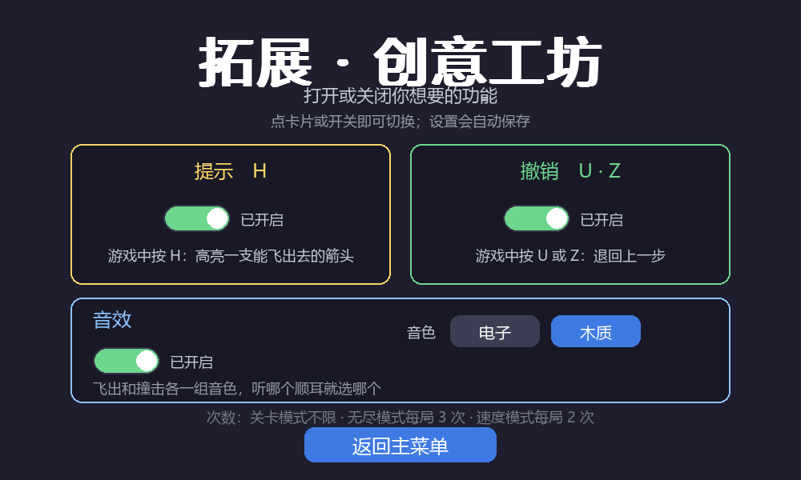
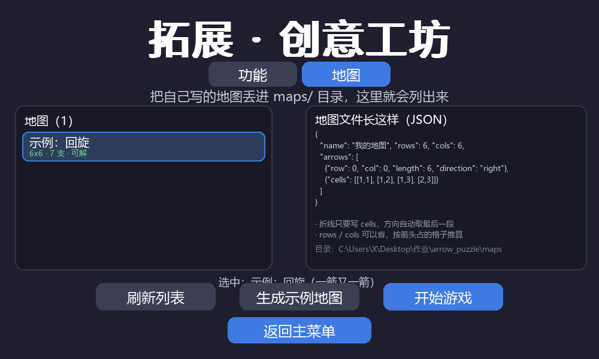
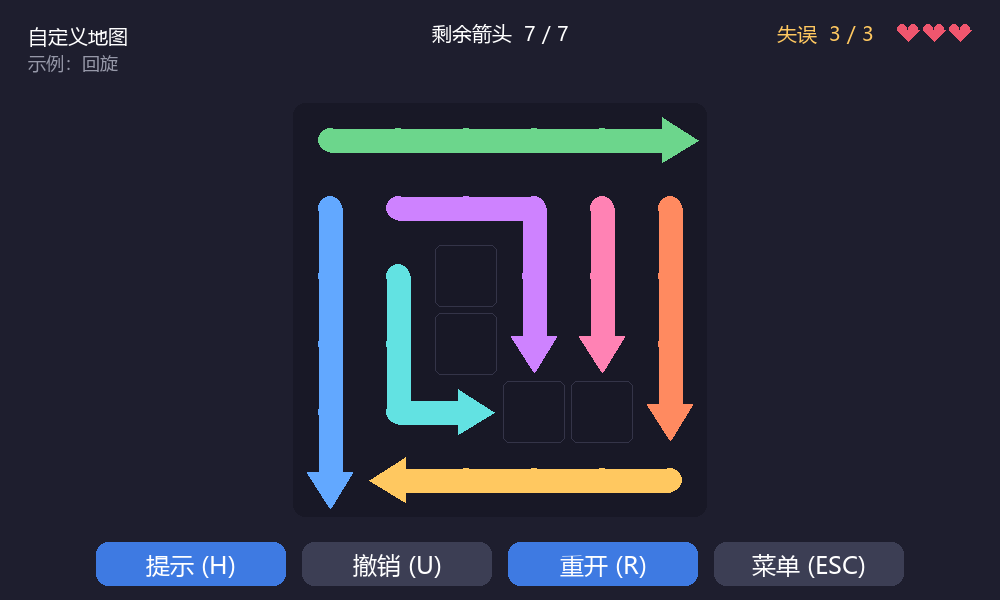

# 《一箭又一箭》——软件工程课程第二次个人作业

> ⚠️ **这是我给你准备的备用草稿，正式博客以你自己写的那篇为准**（你的版本已经按阶段 + 提示词截图组织好了）。
> 这份留着的价值是里面有现成的"项目介绍 / 实现思路"成段文字和 AIGC 汇总表，需要时可以直接摘。
> 里面的关卡数、测试数字都是按**维持 3 关**的实际情况写的，和你博客一致。
>
> 发布前如果要引用这里的图，需要先把 `docs/` 里的截图传到博客园相册再换链接。

| 项目 | 内容 |
| --- | --- |
| 这个作业属于哪个课程 | [202601 软件工程与软件工程实践](https://edu.cnblogs.com/campus/fzu/202601SofwareEngineering) |
| 这个作业要求在哪里 | [软件工程课程第二次个人作业](https://edu.cnblogs.com/campus/fzu/202601SofwareEngineering/homework/16717) |
| 这个作业的目标 | 使用 Python 独立开发一个「一箭又一箭」风格的点击解谜小游戏 |
| 学号 / 姓名 | `102401531` / `<姓名>` |
| 仓库地址 | `<仓库地址>` |

---

## 一、项目展示

程序用 Python + Pygame 写成，**单文件 3700 余行**，双击打包好的 exe 即可运行。

游戏画面：深色棋盘上排布着若干个箭头（**每个箭头是一条有长度、内部还能拐弯的折线**），
点击一个箭头，它要么沿自己指的方向飞出棋盘，要么撞在被挡住的箭头上弹回来、扣掉一次失误。

> **配图说明**：我这里只放了仓库 `docs/` 里现成的三张工坊截图；
> 开始界面、游戏界面、碰撞反馈、提示高亮、通关、失败、速度模式这些，**你博客里已经有了，直接用你自己的**。

| 截图 | 说明 |
| --- | --- |
|  | 创意工坊（功能页）：提示 / 撤销 / 音效三个开关，音效还能选音色 |
|  | 创意工坊（地图页）：`maps/` 目录里的地图会列出来，带尺寸 / 箭数 / 可解性 / 已通关标记 |
|  | 试玩自定义地图：HUD 显示「自定义地图 + 地图名」，提示 / 撤销不限次数 |

---

## 二、游戏介绍

### 规则

棋盘是 6×6（最大的第 3 关是 8×8）的网格，格子里放箭头，箭头朝上/下/左/右之一。

点一个箭头，程序检查它**箭头前方**那条射线上有没有别的箭头：

* **前方没有箭头** → 整支箭沿自己的轨道飞出棋盘并消失；
* **前方有箭头** → 它飞不出去，会冲过去撞一下再弹回原位，同时**失误次数 −1**。

把本关所有箭头清空就过关；失误次数减到 0 则本关失败，可以重开。判定只看同一行或同一列，不涉及斜向。

**一个设计上的关键点**：箭是**沿自己的轨道走**的 —— 头部先沿朝向直行，箭身一节一节填进自己刚腾出来的格子，
所以拐弯的箭头飞出去时会"被抻直"。这也让判定可以简化成一句话：只有箭头那一格会进入新格子，
**所以能不能飞，只看箭头正前方有没有别的箭**。

### 界面

四类界面：开始界面、游戏界面、结果界面（通关/失败/时间到）、以及**创意工坊**。
另有无尽模式和速度模式两个拓展玩法。

游戏界面顶部 HUD：左边关卡进度与关卡名，中间剩余箭头，右边失误次数（用爱心画出来，不依赖字体里的 ❤ 字形）。
底部四个按钮：提示 / 撤销 / 重开 / 菜单。棋盘上方**不写任何提示文字** —— 规则在首页交代一次就够了。

### 主要功能

| 功能 | 说明 |
| --- | --- |
| 关卡模式 | 3 个内置关卡（6×6 / 6×6 / 8×8），难度递增；**每一关的可解性都由程序保证** |
| 无尽模式 | 随机关卡、越玩越大；**失败即整局结束**，成绩记进最佳记录 |
| 速度模式 | 60 秒内尽可能多通过机关，失误一次扣 3 秒 |
| 提示 / 撤销 | 见下 |
| 音效 | 两套音色可选，**波形是代码里现场合成的**，不用任何音频素材文件 |
| 最佳记录 | 存在 `save.json`，首页显示；读不到或读坏了自动退回默认值 |
| 创意工坊 | 功能开关 + **玩家自定义地图上传** |
| 一键打包 | `python build_exe.py` 出可执行文件 |

### 拓展功能

**提示（H 键）**：遍历盘面找一支"正前方没人挡"的箭头，套一圈呼吸金光圈，2.6 秒后自动消失。

**撤销（U / Z 键）**：退回上一步。**这里不能只把箭头放回原位** —— 邻居图是从箭头列表重建出来的，
飞走的箭头那些格子已经从链上摘掉了，只恢复坐标的话图就是错的。
做法是「**只记最初那张图 + 玩家点过的顺序**」，撤销时重新载入最初数据再把剩下的操作安静地重放一遍：

```python
def replay(self, history):
    self.load_level(self.source)                    # 最初那张图
    for (row, col, _was_blocked) in history:
        self.click_cell(row, col, animate=False)    # 安静地重放剩下的操作
```

好处是不用为每一步深拷贝快照，也不用维护邻居变更日志。

**创意工坊**：分成「功能」和「地图」两个页签。

* 功能页：提示 / 撤销 / 音效三个开关，关掉之后游戏中按对应按键没有任何反应；
  卡片刻意只写"怎么用"，不写内部实现；开关写进 `save.json`。
* 地图页：**把 `.json` 放进 `maps/` 目录就算"上传"**。进工坊会自动扫描，
  每张图当场校验格式、数箭头、**判可解性**；格式错/越界/重叠/箭身断开都会把原因红字标在条目上，
  坏文件不会让游戏崩。**自己试玩通关过的图会盖上「已通关」**（按内容指纹记，改了文件自动失效）。

### 特色

**关卡的可解性由程序保证，不靠人工试。** 这一点我踩过坑，下面「实现思路」里展开讲。

---

## 三、实现思路

### 3.1 箭头、方向、关卡怎么表示

方向到位移的映射**全文件只保留一份**，逻辑判定和图形绘制共用它：

```python
DIR_STEPS = {DIR_UP: (-1, 0), DIR_RIGHT: (0, 1), DIR_DOWN: (1, 0), DIR_LEFT: (0, -1)}
```

箭头是"占若干格、内部可以拐弯"的一条折线，用格子路径表示：

```python
class Arrow:
    cells      # 占用的所有格子，从箭尾到箭头
    head/tail  # 箭头格 / 箭尾格
    direction  # 朝向 = 最后一段的方向
    offset     # 沿自己的轨道前进了多少格（动画期间就是"本体"）
```

关卡是纯数据，和逻辑分开：

```python
{"name": "第 1 关 · 入门", "rows": 3, "cols": 3, "max_mistakes": 3,
 "arrows": [arrow(0, 0, 3, DIR_RIGHT), poly([(1,1), (1,2), (2,2)])]}
```

### 3.2 路径检测：为什么只看箭头那一格

箭是沿自己的轨道走的：箭身每一节填进的是它前一节腾出来的格子，**只有箭头会进入新格子**。
所以判定只需要看箭头正前方那条射线。

而"正前方有没有箭"是用一张**单元格邻居图**做的 O(1) 查询：每个被占用的格子记下四个方向上最近的邻居，
判定时沿邻居链跳过自己的箭身，看第一个"别人家的"格子是不是空；箭头飞走后把它每个格子逐个拆链
（上下对接、左右对接）即可。

为什么要跳过"自己的箭身"：拐弯箭头的箭身可能出现在自己箭头的射线上，那不是阻挡。

边界处理上有个坑值得记：**先取下一格再判断越界**的写法，在向上/向左时会先访问到 `grid[-1]`——
Python 不报错，会绕到棋盘另一端，判定结果就错了而且不会抛异常。所以我把边界判断放进循环条件里，
从源头绕开。这一点正好对应当业的测试项 **T03（边缘且朝外的箭头不应越界报错）**。

### 3.3 关卡怎么保证有解

第一版我用「随机生成 + 求解器筛掉无解的」：先算一下满盘时能飞的箭只有贴边朝外的那几支，
级联很快就断掉 —— 随机 6×6 的可解率大约只有**万分之一**，拒绝采样几乎永远失败（实测 200 次重开有 195 次
落到兜底布局上）。另外我自己手工摆的关卡也摆出过死局——箭头互相指着形成闭环，肉眼看不出来。

后来改成**反向构造**：不摆最终布局，而是按「拆除顺序的逆序」一个个放。放第 k 个箭头时，
棋盘上只有"会在它之后才被拆掉"的那些箭头，所以只要它此刻路径是空的就放进去。
这样按放置顺序的逆序点击，每个箭头出手时前方都是空的，**天生有解**。

```python
# 放入 (row, col) 的箭头时，要求该方向到边界之间为空（对已放置的箭头而言）
if not head_ray_can_fly(cells, direction, occupied, rows, cols):
    continue
```

生成之后仍然用求解器再校验一遍做双保险，并且把「**每一关都必须可解**」写成了自动化测试。

### 3.4 动画：动的是"本体"，不是幻影

箭的运动由 `Arrow.offset` 驱动 —— 沿一条"轨道"（箭身格子 + 箭头前方延长出去的格子）前进。
渲染时按 offset 在轨道上取样得到折线，所以**画出来的始终是同一个箭头对象**。
早期版本是"本体留在原地 + 另画一个特效飞出去"，看起来就像发射了一个幻影，是错的。

碰撞反馈也因此很自然：先沿轨道冲到贴着阻挡者，再阻尼振荡弹回原位。

### 3.5 音效是算出来的

不用任何素材文件，直接按正弦/方波/锯齿波算采样点、加衰减包络，塞进 `pygame.mixer.Sound`。
两套音色（电子 / 木质），而且**撞击音刻意做得比飞出音响得多**（实测约 3.1 / 3.3 倍），
不看画面也能听出"这一下撞了"。拿不到音频设备时自动降级静音。

---

## 四、AIGC 使用过程

整个开发过程我都在用 AIGC 编程助手（DeepSeek）辅助。挑 5 个最有代表性的协作：

| 子任务 | 借助何种 AIGC 技术 | AI 实现或提供了什么 | 效果如何 | 人工修改 |
| --- | --- | --- | --- | --- |
| 玩法模型 | DeepSeek 编程助手 | 按第一版需求做出了"旋转箭头对齐方向"的玩法 | **完全跑偏**：这不是"一箭又一箭"的核心玩法 | 我明确纠正"点击后检查同行同列有无阻挡、无阻挡则飞出、有阻挡则失误 −1"，整块重写 |
| 方向映射 | DeepSeek 编程助手 | 生成方向到位移的映射表与判定代码 | 代码能跑，但**画出来朝上、判定朝左**（映射按 (dx,dy) 写、判定按 (dr,dc) 解包） | 收敛成唯一一份 `DIR_STEPS`，判定与绘制共用；并写成测试：渲染出的箭尖朝向必须和数据方向一致 |
| 移动与碰撞反馈 | DeepSeek 编程助手 | 最初实现为"整支箭刚性平移"的特效 | 视觉上像"原地留着一支箭、另一个幻影飞出去又回来" | 改成"沿自己的轨道走"（轨道 + offset），判定随之简化成只看箭头那一格 |
| 关卡可解性 | DeepSeek 编程助手 | 提出随机生成 + 求解器筛选 | 拒绝采样成功率约万分之一，几乎永远落到兜底布局 | 改为反向构造（按拆除顺序倒着摆），并加"每关必须可解"的自动化测试 |
| 真机问题排查 | DeepSeek 编程助手 | 分析段错误堆栈与 mixer 报错 | 定位到字体缓存跨 `pygame.quit()` 复用、以及 mixer 已按默认立体声初始化而我按单声道合成 | 加 `clear_font_cache()`；音效改为先读回 mixer 真实格式再合成，并补 3 种格式的测试 |

### 展开三个

**1. AI 给的代码"能跑"不等于"是对的"——方向映射错位**

判定代码和绘制代码各用了自己的一套方向映射：一边按屏幕坐标 `(dx, dy)` 写、另一边按行列增量 `(dr, dc)` 解包，
于是 `UP=(0,-1)` 被当成"行不变、列 −1"＝**向左**。程序不报错、绝大多数格子看着也正常，只在边缘暴露。
是我截图观察时发现"第一行第二个箭头明明前方是空的，却被左边那个挡住了"，才定位到这个问题。

修法不是改一行，而是**把映射收敛成唯一一份** `DIR_STEPS`，让判定和绘制共用；
再加一条测试：把单格箭头画到离屏画面上，取亮像素质心，验证"箭尖朝向"和 `DIR_STEPS` 一致。
后来这条测试还抓到我自己写错的判据（三角形质心偏向底边，所以位移方向应该和朝向**相反**）。

**2. "幻觉"式的动画：AI 不理解"本体"和"表现"的区别**

第一版碰撞反馈是"本体不动 + 另一个特效飞出去再回来"。视觉上就是原地留着一支箭、幻影飞了一圈，
玩家一眼就看出不对。指出之后改成 `Arrow.offset` 驱动本体沿轨道运动，规则也随之简化。
这件事让我意识到：**语义层面的要求（"应该是本体出去"）得由人来说清楚，AI 不会自己想到。**

**3. 最危险的一类 bug：所有测试都绿、功能却全死**

音效在无窗口的自动化测试里一切正常，我把它放到真实音频设备上跑，才发现 `音效可用=False`：`pygame.init()`
在有声卡的机器上会先用默认参数（立体声）把 mixer 开好，而 `mixer.init()` 对已初始化的 mixer 是**空操作**，
我却按单声道合成 PCM 数据，`Sound(buffer=...)` 长度对不上直接抛错，又被 `try/except` 吞掉。
换句话说：**这个功能在有声卡的机器上一次都不会响，而所有测试都是绿的。**

修法是"不要假设格式，先读回 mixer 的真实声道数/采样率再按那个格式合成"，并补了 3 种格式（44100/48000/单声道）
的用例。教训：`try/except` 吞掉初始化错误，最容易造成"测试全绿但功能全死"；**"能跑起来"和"好使"是两回事**。

### 关键提示词记录（好 / 差）

作业要求一并记录提示词的效果，我挑几组对照：

| 类型 | 提示词（节选） | 结果 |
| --- | --- | --- |
| ✅ 好 | "点击箭头后，检查其前进方向（同行或同列）是否有其他箭头阻挡。若无阻挡，箭头飞出棋盘并消失；若有阻挡，箭头产生碰撞反馈，且玩家失误次数减 1。" | 一句话把规则、判定范围、两种结果、失败条件全说清，AI 直接给出可用的核心逻辑 |
| ✅ 好 | "箭要沿着箭头移动，不是整体刚性移动，碰撞反馈的时候原地还留下一个箭，就好像只是一个幻影被发射出去又回来了，这不对，应该是本体出去" | 说清了"现象 + 我的判断 + 期望"，AI 才能把动画从"另画特效"改成"驱动本体" |
| ✅ 好 | "把提前判断一个箭能不能走的红绿框去掉，否则玩家只要每个箭头看颜色就好" | 一句话点出设计后果（谜题被破坏），而不只是"去掉某功能" |
| ✅ 好 | "如果这个工作量接近甚至超过本体，就不搞" | 给了 AI 明确的取舍判据，避免为了炫技堆功能（可视化地图编辑器就是因此砍掉的） |
| ❌ 差 | 第一版只说"搭建一个点击解谜小游戏的基础框架，实现状态机，先用纯色填充" | 没定义"点一下会发生什么"，AI 只能猜，做出了完全错误的"旋转对齐"玩法，整块返工 |
| ❌ 差 | "再优化一下""差不多了" | 没有目标和验收标准，AI 只能自己猜要优化什么，容易做偏或做过头 |

---

## 五、测试结果

测试用无窗口方式跑（SDL 的 dummy 驱动，不需要显示器声卡），一条命令复现：

```bash
python run_tests.py                 # 作业要求的 T01~T06 + 自选的 T07~T09
python arrow_puzzle.py --selftest   # 内部 23 项回归自检
```

### 5.1 作业要求的测试项

T01~T06 不是直接调函数，而是构造真实的 `MOUSEBUTTONDOWN` 事件、按格子中心的像素坐标投给主循环，
这样连"屏幕坐标 → 格子坐标"的换算也一起测到了。

| 编号 | 测试内容 | 预期结果 | 实际结果 | 是否通过 |
| --- | --- | --- | --- | --- |
| T01 | 点击前方无阻挡的箭头 | 箭头飞出棋盘并消失 | 返回 `cleared`；它占的格子全部清空；剩余箭头 6→5；邻居图格子数 14→12；动画期间 `flying=True`，结束后对象被回收 | 通过 |
| T02 | 点击前方有阻挡的箭头 | 箭头不消失，失误次数减 1 | 返回 `blocked`；箭头三个格子原样保留；失误 0→1；剩余箭头不变；产生弹回动画 | 通过 |
| T03 | 点击位于边缘且朝向棋盘外的箭头 | 箭头正常消失，不发生越界错误 | 遍历 3 关筛出全部 9 支"贴边朝外"的箭（覆盖上下左右四条边）逐个点掉，全部正常飞出，无越界异常 | 通过 |
| T04 | 消除本关全部箭头 | 显示通关并进入下一关 | 清空后状态 `state_win`，通关界面主按钮「进入下一关」，点击后进入第 2 关 | 通过 |
| T05 | 失误次数耗尽 | 显示失败并允许重新开始 | 状态 `state_fail`，按钮为「重新开始 / 返回主菜单」，重开后失误 0/3、箭头数恢复 | 通过 |
| T06 | 游戏进行中重新开始 | 箭头布局和失误次数恢复 | 玩脏之后按 R：剩余箭头 / 失误 / 点击数 / 邻居图格子数与开局签名**完全一致** | 通过 |

### 5.2 自选测试项

| 用例 | 验证点 | 结果 |
| --- | --- | --- |
| 移动规则一致性 | 邻居图判定的结果 与 几何扫描判定的结果逐步比对（3 关拆到清空 + 45 个随机关，共 75 次校验） | 通过 |
| 关卡可解性 | 每个内置关卡都能被求解器清空；200 个随机关卡 100% 可解 | 通过 |
| 关卡数据合法 | 无越界、无重叠、箭身不断开、方向与最后一段一致 | 通过 |
| 重开无残留 | 重开后不残留上一局的箭头对象/格子节点 | 通过 |
| 悬停不泄漏答案 | 悬停时红/绿像素为 0；"能飞"和"被挡"两支箭的悬停外观逐格一致 | 通过 |
| 撤销正确性 | 逐步撤销后与"一步之前"的签名一致；撤到底等于**重新载入本关** | 通过 |
| 提示正确性 | 高亮的一定是 `can_fly()` 的箭头，且会超时消失 | 通过 |
| 音效 | 两套音色各两种音效；**撞击/飞出音量比 ≥ 1.8**；无音频设备时静音不报错 | 通过 |
| 自定义地图 | 坏 json / 越界 / 重叠 / 箭身断开都报错不崩；通关后盖「已通关」，改图后失效 | 通过 |
| 打包产物 | exe 自己跑一遍 23 项自检，退出码 0；启动游戏后窗口正常 | 通过 |

### 5.3 运行输出

```
$ python run_tests.py
========================================================================
《一箭又一箭》验收测试  T01 ~ T09
========================================================================
运行环境：Python 3.7.0 / pygame 2.1.2 / SDL 2.0.18
...
编号    测试内容                           预期结果                       结论
T01   点击前方无阻挡的箭头                     箭头飞出棋盘并消失                  PASS
T02   点击前方有阻挡的箭头                     箭头不消失，失误次数减 1              PASS
T03   点击位于边缘且朝向棋盘外的箭头                箭头正常消失，不发生越界错误             PASS
T04   消除本关全部箭头                       显示通关并进入下一关                 PASS
T05   失误次数耗尽                         显示失败并允许重新开始                PASS
T06   游戏进行中重新开始                      箭头布局和失误次数恢复                PASS
T07   音效：飞出/碰撞各一组、两套音色               有飞出与碰撞音效，而且碰撞明显更响          PASS
T08   音效开关与选择保存                      关掉后无声，选择写入存档               PASS
T09   音效适配不同 mixer 格式                有声卡的机器上也能正常出声              PASS

合计：9/9 通过
```

内部自检 23 项也全部通过（`python arrow_puzzle.py --selftest`）。

除了无窗口测试，我也用真实显示窗口跑过：窗口正常创建、60 FPS、中文字体与棋盘显示正常，
鼠标点击、提示/撤销/重开按钮、工坊两个页签、结算界面都能用；打包成 exe 之后再跑了一遍自检（退出码 0）。

详细的测试过程、以及测试过程中发现并修复的 6 个缺陷（含一个段错误、一个"测试全绿但功能全死"）
记在仓库的 `BLOG_测试记录.md` 里。

---

## 六、个人软件过程（PSP）报告

| 阶段 | 预计耗时（分钟） | 实际耗时（分钟） | 差异（实际 − 预计） |
| --- | ---: | ---: | ---: |
| 需求、环境和任务拆分 | 10 | 3 | −7 |
| 规则、关卡与测试；界面并行开发 | 240 | 120 | −120 |
| 集成、自动化验收与画面检查 | 30 | 15 | −15 |
| README、截图和测试记录 | 30 | 20 | −10 |
| **合计** | **310** | **158** | **−152** |

差异集中在「规则、关卡与测试；界面并行开发」这一项：界面与规则/关卡/测试是**并行推进**的，
样板代码（状态机骨架、界面绘制、动画、音效合成）由 AIGC 出初稿、我只做核对与修改，
关卡可解性改用**反向构造**后也避免了第一版人工摆关卡的返工。
也要如实说一句：返工发生在预估之外——第一版玩法做错、方向映射 bug 都导致过整块重写。

---

## 七、心得体会

**AI 给的代码能跑，不等于是对的。** 方向映射错位那次最典型：程序不报错，绝大多数情况看着也正常，
只在边缘暴露——而且那个错误是"画出来朝上、判定朝左"，纯靠运行日志根本看不出来，是我盯着截图看出来的。

**人工摆的关卡真的是错的。** 我自己摆的关卡里有死局（箭头互相指着形成闭环），肉眼完全看不出来。
这件事让我明白"把正确性写成自动化测试"不是形式主义——它是真的能挡住错误的。

**测试本身也会错。** 我的自检里有一版判据写反了（以为三角形质心偏向箭尖，其实偏向底边），
33 支箭全报错；还有一次测试数据里"两支箭重叠"其实根本不重叠。断言失败时先怀疑测试。

**最危险的是"测试全绿、功能全死"。** 音效那次，无窗口测试里一切正常，放到真机上才发现功能是哑的——
因为 `try/except` 把初始化错误吞了。**"能跑起来"和"好使"中间差着一个验证。**

**AI 不知道界面好不好看、也不知道"什么才算对"。** 文字压到按钮上、动画像幻影，都是我截图给它看之后才改的。
所以关键的地方我得自己能讲清楚：路径检测的边界为什么那么写、关卡为什么一定有解、撤销为什么要重放而不是存快照。

**收获**：这次最大的收获不是学会 Pygame，而是摸出了一套和 AI 协作的分寸——
让 AI 写，但关键逻辑自己看懂、自己验证；需求要写清"输入是什么、输出是什么、什么算对"；
复杂的东西先要一个小版本，再一轮一轮改。

---

仓库地址：`<仓库地址>`

（感谢阅读 ヽ(・ω・)ﾉ ）
